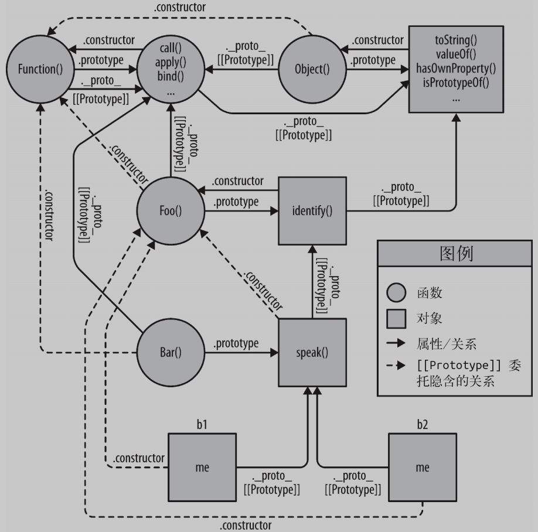
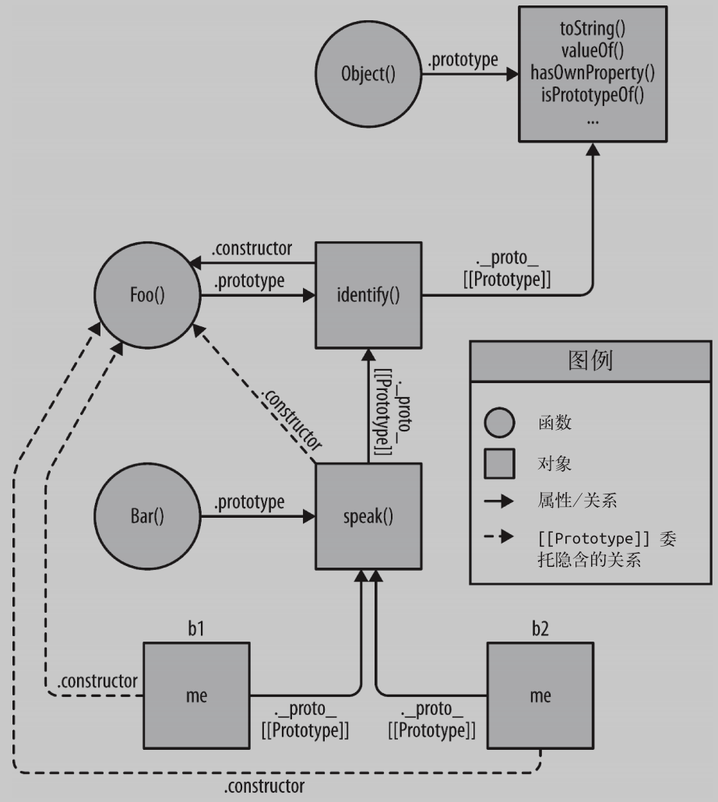
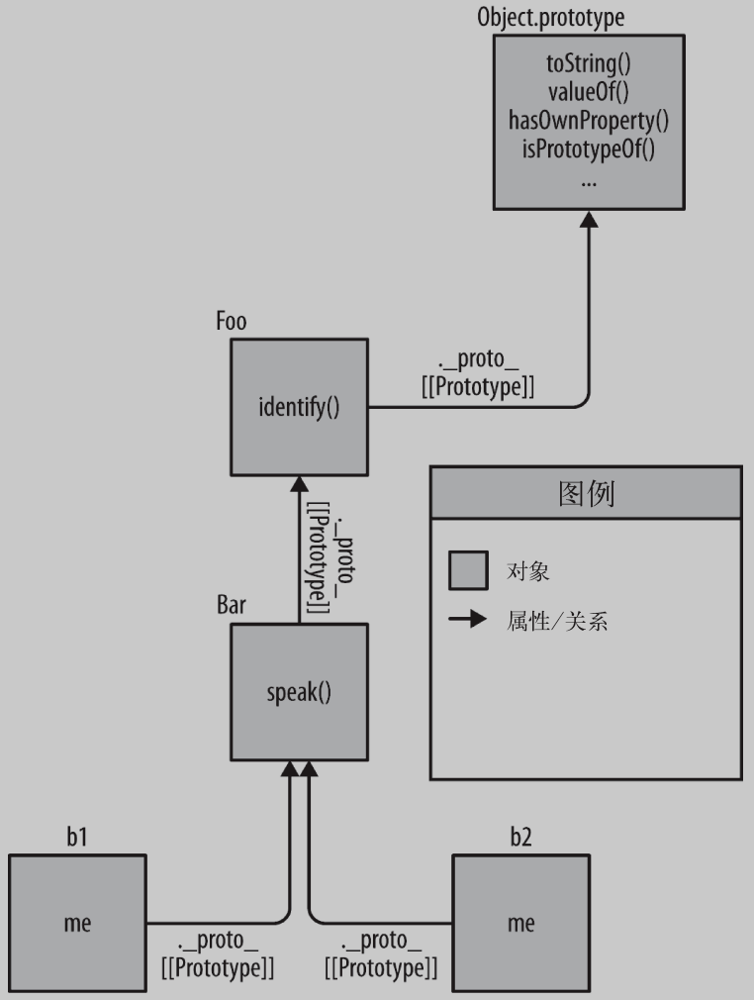

## Javascript


### 作用域和闭包

#### 引擎查询

LHS/RHS：变量在赋值操作左边(LHS)、在赋值操作右边(RHS)

```js
a = 2 //LHS
b = a // ..=a RHS
```

嵌套作用域：作用域发生嵌套，引擎会在外层作用域中继续查找，直到找到或者抵达全局作用域。

#### 异常

RHS中若找不到，则抛出**ReferenceError**

LHS找不到，则会在全局作用域中创建该变量，**注意！**若采用**'use strict'** (ES5中引入) 则不会创建，同样抛出**ReferenceError**

RHS若查找到但进行了不合理操作，则抛出**TypeError**

#### 查找

**”遮蔽效应“**：作用域查找会在找到第一个匹配的标识符时停止。逐级向上查找。

全局变量会自动成为全局对象，例如window.a

#### 欺骗词法

1. eval

```js
function foo(str,a) {
  eval( str )
  console.log( a, b );
}
var b = 2;
foo( "var b = 3;" 1 ); // 1, 3 遮蔽了外部同名变量b=2
```

通过代码欺骗和假装**词法期**来修改**词法作用域环境**。

在严格模式中，eval有其自己的词法作用域，无法修改所在的作用域：

```js
function foo(str) {
  "use strict";
  eval( str );
  console.log( a ); //ReferenceError: a is not defined
}
foo( "var a = 2" )
```

2. with

重复引用同一个对象中多个属性的快捷方式

```js
var obj = {
  a: 1,
  b: 2,
  c: 3
}
//可通过with(...)
with(obj) {
  a = 3;
  b = 4;
  c = 5
}
```

同时还可以用于赋值

```js
function foo(obj) {
  with(obj) {
    a = 2;
  }
}

var o1 = {
  a: 3
};

var o2 = {
  b: 3
};

foo( o1 );
console.log( o1.a ); //2

foo( o2 );
console.log( o2.a ); //undefined
console.log( a ); // 2--a被泄露到了全局作用域
```

上述两种方式会存在运行效率问题，同时不推荐使用，在严格模式下会被限制。


#### 函数作用域

通过最小暴露原则进行设计，可以实现内容私有化，规避作用域冲突。

```js
function doSomething(a) {
  function doSomethingElse(a) { //内部函数
    return a - 1;
  }
  var b; //内部变量
  b = a + doSomethingElse( a * 2);
  console.log( b * 3);
  
}
doSomething( 2 ); // 15
```

通过内部定义可以隐藏变量和函数定义，但是会导致额外的**作用域污染**

```js
//...全局作用域
function foo() {
}
foo(); //具名函数foo()污染了全局作用域

//可通过包装函数来解决作用域污染
(function foo(){ //函数会当做函数表达式来处理
  ...
})(); //第二个()表示立即执行 IIFE(Immediately Invoked Function Expression)
```


#### 匿名和具名

匿名函数会导致

1. 在栈追踪中不会显示出有意义的函数名，导致调试困难
2. 引用自身时需要使用已过期的arguments.callee
3. 可读性差

```js
setTimeout( function() { //匿名函数
  ...
},1000)

setTimeout( function timeoutHandler() { //行内函数表达式
  ...
},1000)
```


#### 立即执行函数表达式

两种方式：

```js
(function foo(){ .. })()
(function(){ .. }())
```

IIFE可以当做函数调用并传递参数进去

```js
(function IIFE( global ){ //将window参数名global传入
  var a = 3;
  console.log( a ); //3
  console.log( global.a ); //2
})( window );
console.log( a ); //2
```

可以解决undefined默认标识符被错误覆盖导致的异常

```js
undefined = true; //错误赋值

(function IIFE( undefined ){
  var a;
  if(a === undefined){
    console.log("Undefined is safe here!");
  }
})(); //undefined
```

可以倒置代码运行顺序，UMD中广泛使用：

```js
var a = 2;
(function IIFE( def ){
  def( window );
})(function def( global ){ //将window作为global在def中使用
  var a = 3;
  console.log( a ); //3
  console.log( global.a ); //2
});
```


#### 块作用域

在for中，定义的变量i会被绑定在**外部作用域中**！！！

```js
for (var i=0; i<10; i++) {
  console.log( i );
}
```

##### 1.with

用with从对象中创建的作用域仅在with生命中而非外部作用域中有效。

##### **2.try/catch**

从ES3规范中规定catch分句中会创建一个块作用域，仅在catch中有效

```js
try {
  undefined(); //创造异常
}
catch (err) {
  console.log( err );
}
console.log( err ) //ReferenceError
```

###### ES6之前的块作用域替代方案

```js
// 在ES6中可以利用块作用域
{
  let a = 2;
  console.log( a ); // 2
}
console.log( a ); // ReferenceError

// ES6之前，try/catch中的catch是块作用域，从而实现。
try{throw 2;}catch(a){
  console.log( a ); // 2
}
console.log( a ); // ReferenceError
```


##### **3.let**

let形成了一个块作用域

```js
var foo = true;
if(foo) {
  { // <--显式的块
    let bar = foo * 2;
    bar = something( bar );
    console.log( bar );
  }
}
console.log( bar ); //ReferenceError
```

(1) 垃圾收集

```js
function process(data) {
}
var someReallyBigData = { .. }
process( someReallyBigData );
var btn = document.getElementById( "my_button" );
btn.addEventListener( "click", function click(evt){
  console.log("button clicked");
}, /*capturingPhase*/false );
```

click形成了一个覆盖整个作用域的闭包，会导致someReallyBigData无法回收。可通过块作用域解决：

```js
{ //块中定义内容可以销毁
  let someReallyBigData = { .. };
  process( someReallyBigData )
}
```

(2) let循环

let不仅将i绑定到了for循坏的块中，事实上将其重新绑定到了循环的每一个迭代中重新赋值。

```js
{
  let j;
  for (j=0; j<10; j++){
    let i = j //每个迭代重新绑定
    console.log( i );
  }
}
```

###### let和var的区别

1. var存在变量提升，let不存在

2. let不允许在相同作用域内，重复声明同一个变量

3. 暂时性死区

   ```js
   // 在代码块内，使用let声明前该变量均不可用
   //暂时性死区 temporal dead zone TDZ
   var tmp = 123;
   if(true){
     tmp = 'abc'; //ReferenceError
     let tmp;
   }
   ```

##### 4.const

const为固定常量，也可以用来创建块作用域变量。


#### 提升

##### 1.变量提升

变量和函数的所有声明会在任何代码被执行前首先被处理。

范例1：

```js
// 代码
a = 2;
var a;
console.log( a );
// 执行顺序
var a;
a = 2;
console.log( a ); //2
```

范例2：

```js
// 代码
console.log( a );
var a = 2;
// 执行顺序
var a;
console.log( a ); //undefined
a = 2;
```

范例3：

```js
foo(); //不是ReferenceError，而是TypeError
var foo = function bar() {
  // ...
};
```

foo变量定义被提升，但并未赋值，对于undefined进行函数调用抛出TypeError异常。

范例4：

```js
foo(); //TypeError
bar(); //ReferenceError
var foo = function bar() {
  // ...
};

// 实际提升后
var foo;
foo(); //TypeError
bar(); //ReferenceError
foo = function(){
  var bar = ...self...
  // ...
}
```

##### 2.函数优先

函数声明和变量声明都被提升，但是函数优先级高

````js
// var foo和function foo声明重复而被忽略，函数声明被提到普通变量之前。同时出现在后面的函数会覆盖前面的,最终输出3
foo(); //3
var foo;
function foo(){
  console.log( 1 );
}
var foo = function(){
  console.log( 2 );
};
function foo(){
  console.log( 3 );
};

//引擎理解形式如下：
function foo() {
  console.log( 3 );
}
foo(); //3
foo = function(){
  console.log( 2 );
};
````


#### 闭包

当函数可以记住并访问所在的词法作用域，即使函数实在当前词法作用域之外执行，这时就产生了闭包。

范例1：

```js
//bar()在自己定义的词法作用域以外执行，它拥有涵盖foo()内部作用域的闭包，使该作用于一直存活。
function foo() {
  var a = 2;
  function bar(){
    console.log( a );
  }
  return bar;
}
var baz = foo();
baz(); // 2 ——闭包
```

范例2：

```js
function foo(){
  var a = 2;
  function baz(){
    console.log( a ); //2
  }
  bar( baz )
}
function bar(fn){
  fn(); //闭包。 fn即baz拥有foo()的整个作用域，访问变量a
}
foo();
```

范例3：

```js
//timer涵盖wait(..)的作用域闭包，传递给setTimeout(..),同时还保留对变量message的引用
function wait(message){
  setTimeout( function timer(){
    console.log( message )
  }, 1000);
}
wait( "Hello,closure!" )
```

##### 循环

```js
//延迟函数的回调会在循环结束时才执行。
for(var i=1;i<=5;i++){
  setTimeout(function timer(){
    console.log(i); //6 6 6 6 6
  },i*1000);
}

//将i作为参数传递给IIFE解决问题。
for(var i=1;i<=5;i++){
  (function(j)
  	setTimeout(function timer(){
      console.log( j ); //1 2 3 4 5
    }, j*1000 );
  )( i );
}

//进一步的
for(let i=1; i<=5; i++){
  setTimeout( function timer(){
    console.log( i );
  }, i*1000 );
}
```

##### 模块

以下模式称为**模块**，实现模块方式的方法称为模块暴露

模块模式的必要条件：

1. 必须有外部的封闭函数，该函数被至少调用一次
2. 封闭函数返回一个内部函数，这样内部函数才能在私有作用域中形成闭包，并可以访问或者修改私有状态。

```js
function CoolModule(){
  var something = "cool";
  var another = [1, 2, 3];
  function doSomething(){
    console.log( something );
  }
  function doAnother(){
    console.log( another.join( " ! ") );
  }
  return{
    doSomething: doSomething,
    doAnother: doAnother
  };
}
var foo = CoolModule();

foo.doSomething(); //cool
foo.doAnother(); // 1 ! 2 ! 3
```

单例模式：

```js
var foo = (function CoolModule(){
  var something = "cool";
  var another = [1, 2, 3];
  function doSomething(){
    console.log( something );
  }
  function doAnother(){
    console.log( another.join( " ! ") );
  }
  return {
    doSomething: doSomething,
    doAnother: doAnother
  }
})(); //立即调用函数IIFE

foo.doSomething();
foo.doAnother();
```

###### 现代模块机制

通过封装进API，实现模块依赖加载器/管理器

```js
var MyModules = (function Manager(){
  var modules = {};
  function define(name, deps, impl){
    for(var i=0; i<deps.length; i++){
      deps[i] = module[deps[i]];
    }
    modules[name] = impl.apply( impl, deps );
  }
  function get(name){
    return modules[name];
  }
  return {
    define: define,
    get: get
  }
})();
```

使用方法：

```js
MyModules.define("bar",[],function(){
  function hello(who){
    return "Let me introduce: " + who;
  }
  return {
    hello: hello
  };
});

MyModules.define("foo",["bar"],function(bar){
  var hungry = "hippo";
  function awesome(){
    console.log( bar.hello( hungry ).toUpperCase());
  }
  return {
    awesome: awesome
  };
});

var bar = MyModules.get( "bar" );
var foo = MyMudules.get( "foo" );

console.log( 
  bar.hello("hippo")
); //Let me introduce: hippo
foo.awesome(); // LET ME INTRODUCE: HIPPO
```

###### 未来的模块机制

ES6增加一级语法支持，导入或导出其他模块或特定的API成员，模块需要定义在**独立文件中**，没有**“行内”**格式。

```js
//bar.js
function hello(who){
  return "Let me introduce: " + who;
}
export hello;
//foo.js
import hello from "bar";
var hungry = "hippo";
function awesome(){
  console.log(
    hello( hungry ).toUpperCase()
  );
}
export awesome;
//baz.js
module foo from "foo";
module bar from "bar";
console.log(
	bar.hello("rhino")
); //let me introduce: rhino
foo.awesome(); //LET ME INTRODUCE: HIPPO
```


### this解析

调用栈中的调用位置，决定了this的绑定

```js
function baz() {
  // 当前调用栈是：baz
  // 因此，当前调用位置是全局作用域
  console.log( "baz" );
  bar(); // <-- bar 的调用位置
}

function bar() {
  // 当前调用栈是 baz -> bar
  // 因此，当前调用位置在 baz 中
  console.log( "bar" );
  foo(); // <-- foo 的调用位置
}

function foo() {
  // 当前调用栈是 baz -> bar -> foo
  // 因此，当前调用位置在 bar 中
  console.log( "foo" );
}

baz(); // <-- baz 的调用位置
```

#### 绑定规则

##### 默认绑定

决定this绑定对象的并不是调用位置是否处于严格模式，而是函数体是否处于严格模式，从而this绑定到undefined或者全局对象上

```js
//this的默认绑定指向全局对象
function foo(){
  console.log( this.a )
}
var a =2;
foo(); // 2

//在严格模式下，全局对象无法使用默认绑定，此处的this会绑定到undefined
function foo(){
  "use strict"
  console.log( this.a )
}
var a = 2;
foo(); // TypeError: this is undefined

//虽然this的绑定取决于调用位置，但是只有foo()运行在非strict mode下时，默认绑定才能绑定到全局对象；严格模式下与foo()的调用位置无关。
function foo() {
  console.log( this.a );
}
var a = 2;
(function(){
  "use strict";
  foo(); // 2
})();
```

##### 隐式绑定

对象属性引用链中只有最顶层或者说最后一层会影响调用位置。

```js
function foo() {
  console.log( this.a );
}
var obj2 = {
  a: 42,
  foo: foo
};
var obj1 = {
  a: 2,
  obj2: obj2
};
obj1.obj2.foo(); // 42
```

###### 隐式丢失

被隐式绑定的函数会丢失绑定对象，应用默认绑定，将this绑定到全局对象或者undefined上。 

```js
function foo() {
  console.log( this.a );
}
function doFoo(fn) {
  // fn 其实引用的是 foo
  fn(); // <-- 调用位置！
}
var obj = {
  a: 2,
  foo: foo
};
var a = "oops, global"; // a 是全局对象的属性
doFoo( obj.foo ); // "oops, global"

//调用语言内置函数没有区别
setTimeout( obj.foo, 100); // "oops, global"
```

参数传递也是一种隐式赋值

##### 显式绑定

可通过call(..)和apply(..)进行显式绑定，但显式绑定无法解决丢失绑定问题。

```js
var a = 123;
function foo(){
  console.log( this.a );
}
var obj = {
  a:2
};
foo.call( obj ); //2 通过.call(..)强制将this绑定到obj上
setTimeout( foo, 100 ); //123 绑定丢失
```

当传入一个原始值来当做this的绑定对象，这个原始值会被转换成它的对象形式( new String(..)、new Boolean(..)或者new Number(..))。这成为“装箱”。

###### call和apply区别

参数传递格式不同，apply为数组形式，call为参数列表形式
apply( [ thisObj [ , argArray ] ] );
call( [ thisObject [ , arg1 [ , arg2 [ , ... , argn ] ] ] ] );

###### apply的用法

apply可以将一个数组默认转换为一个参数列表。对于Math.max不支持数组形式的参数，但是支持Math.max(param1, param2, param3...)。因此可以通过apply来解决这一问题；Arrayprototype.push方法也可以通过apply来解决数组的传值。

```js
Math.max.apply( null, array );
Math.min.apply( null, array );

var arr1 = new Array("1", "2", "3");
var arr2 = new Array("4", "5", "6");
Array.prototype.push.apply( arr1, arr2 );
```

###### 硬绑定

显式的强制绑定，无论如何调用函数bar，都会手动在obj上调用foo

```js
function foo() {
  console.log( this.a );
}
var obj = {
  a:2
};
var bar = function() {
  foo.call( obj );
};
bar(); // 2
setTimeout( bar, 100 ); // 2
// 硬绑定的 bar 不可能再修改它的 this
bar.call( window ); // 2
```

硬绑定的典型应用场景就是创建包裹函数，传入所有的参数并返回接收到的所有值

```js
var bar = function(){
  return foo.apply( obj, arguments );
}

//也可以创建一个可复用的辅助函数
function bind(fn, obj){
  return function(){
    return fn.apply( obj, arguments );
  }
}
...
var bar = bind( foo, obj );
var b = bar( 3 );
```

由于硬绑定的常用性，在ES5中提供了内置的方法Function.prototype.bind，使用.bind(..)会返回一个硬编码的新函数，并将参数设置为this的上下文并调用原始函数。

###### API调用的“上下文”

第三方库或者JavaScrpit语言和宿主环境中的许多新的内置函数，都提可选参数，被称为“上下文”(context)，确保回调函数使用指定的this

```js
[1, 2, 3].forEach( foo, obj ); //把this绑定到obj
```

##### new绑定

使用new来调用函数会执行四步操作：

1. 创建一个全新对象
2. 新对象被执行[[原型]]连接
3. 新对象绑定到函数调用的this
4. 如果没有返回其他对象，new表达式中的函数调用会自动返回新对象

```js
function foo(a) {
	this.a = a;
}
var bar = new foo(2);
console.log( bar.a ); // 2
```

##### 优先级

new优先级 > 显式优先级

```js
function foo(p1,p2) {
this.val = p1 + p2; }
// 之所以使用 null 是因为在本例中我们并不关心硬绑定的 this 是什么
// 反正使用 new 时 this 会被修改
var bar = foo.bind( null, "p1" );
var baz = new bar( "p2" );
baz.val; // p1p2
```

###### 判断this

1. new绑定，this绑定的是新创建的对象

   ```js
   var bar = new foo()
   ```

2. call、apply (显式绑定)，this绑定是指定的对象

   ```js
   var bar = foo.call(obj2)
   ```

3. 上下文对象调用(隐式绑定)，this绑定的是上下文对象。

   ```js
   var bar = obj1.foo()
   ```

4. 如果都不是，使用默认绑定。在严格模式下绑定undefined，否则绑定到全局对象

   ```js
   var bar = foo()
   ```

#### 绑定例外

##### 忽略this

把null或者undefined作为this的绑定对象传入call、apply或者bind，应用默认规则绑定。
**应用场景**：使用apply(..)来展开一个数组，并当做参数传入函数。bind(..)可以对参数进行柯里化(预先设置一些参数)。
但是默认规则会把**this绑定到全局对象**，会导致全局对象修改等问题、

```js
function foo(a,b){
  console.log( "a:" + a + ", b:" + b );
}
//把数组展开成参数
foo.apply( null, [2, 3] ); // a:2, b:3

//使用bind(..)进行柯里化
var bar = foo.bind( null, 2);
bar( 3 ); // a:2, b:3
```

###### **更安全的this**

可以传入特殊对象，把this绑定到DMZ(demilitarized zone，非军事区)

```js
//创建了一个空对象，但是相比{}，不会创建Object.prototype这个委托
var ø = Object.create( null ); //创建一个DMZ对象
foo.apply( ø, [..] );
```

##### 间接引用

```js
function foo() {
  console.log( this.a );
}
var a = 2;
var o = { a: 3, foo: foo };
var p = { a: 4 };
o.foo(); // 3
(p.foo = o.foo)(); // 2
//p.foo = o.foo 返回值是目标函数的引用，调用的是foo()而不是p.foo()或者o.foo()，因此这里应用的是默认绑定。
```

##### 软绑定

硬绑定后无法通过显式或者隐式来修改this，可以给默认绑定指定一个全局对象或者undefined以外的值来实现硬绑定相同效果，同时保留修改this的能力。

```js
if (!Function.prototype.softBind) {
  Function.prototype.softBind = function(obj) {
    var fn = this;
    // 捕获所有 curried 参数
    var curried = [].slice.call( arguments, 1 );
    var bound = function() {
      return fn.apply(
        (!this || this === (window || global)) ?
        	obj : this
        curried.concat.apply( curried, arguments )
      );
    };
    bound.prototype = Object.create( fn.prototype );
    return bound;
  };
}
```

上述代码会检查调用时的this，如果是全局对象或者undefined，就把指定的默认对象obj绑定到this，否则不会修改this

```js
function foo() {
  console.log("name: " + this.name);
}
var obj = { name: "obj" },
    obj2 = { name: "obj2" },
    obj3 = { name: "obj3" };
var fooOBJ = foo.softBind( obj );
fooOBJ(); // name: obj
obj2.foo = foo.softBind(obj);
obj2.foo(); // name: obj2 <---- 看！！！
fooOBJ.call( obj3 ); // name: obj3 <---- 看！
setTimeout( obj2.foo, 10 );
// name: obj <---- 应用了软绑定
```

#### this词法

箭头函数根据外层（函数或全局）作用域来决定this，箭头函数的绑定无法被修改。

```js
function foo(){
  return (a) => {
    //this继承自foo()
    console.log( this.a )
  };
}
var obj1 = { a:2 };
var obj2 = { a:3 };

var bar = foo.call( obj1 );
bar.call( obj2 ); // 2
```


### 对象

#### 类型

JavaScript共有六种主要类型：string、number、boolean、null、undefined、object

前5种简单基本类型不是对象，null有时会被当做一种对象，但是其实这是语言本身的一个bug，即对null执行typeof null会返回字符串"object"。（JavaScript中二进制前三位为0会被判断为object，**null的二进制全是0**，所以执行typeof会返回"object"）

##### 内置对象

对象子类型被称为内置对象：

String、Number、Boolean、Object、Function、Array、Date、RegExp、Error

这些内置函数可以当做构造函数来使用（new产生的函数调用）

```js
//此处只是一个字面量不可变，若进行操作需要转换成String对象
//语言会在必要时自动把字符串转换成一个String对象
var strPrimitive = "I am a string";
typeof strPrimitive; // "string"
strPrimitive instanceof String; // false

var strObject = new String( "I am a string" );
typeof strObject; // "object"
strObject instanceof String; // true

// 检查 sub-type 对象
Object.prototype.toString.call( strObject ); // [object String]
```

null和undefined没有构造形式，只有文字形式。
Date只有构造，没有文字形式。
对于Object、Array、Function和RegExp，无论使用文字形式还是构造形式，都是对象，不是字面量。
Error一般在抛出异常自动创建，也可以new Error(..)。

#### 内容

```js
var myObject = {
  a: 2
};
myObject.a; // 2 属性访问，需满足标识符的命名规范
myObject["a"]; // 2 键访问，可接受任意UTF-8/Unicode字符串
```

##### 可计算属性名

ES6中增加了可计算属性名，使用[]包裹表达式来当做属性名

```js
var prefix = "foo";
var myObject = {
  [prefix + "bar"]: "hello",
  [prefix + "baz"]: "world"
};
myObject["foobar"]; // hello
myObject["foobaz"]; // world
```

##### 数组

数组也支持 [ ] 访问形式，数组通过索引值来访问，也可以添加命名属性（ . 语法或者 [ ] 语法）

```js
//当向数组添加一个属性，但是属性名“看起来”想一个数字，则会变成数组下标
var myArray = [ "foo", 42, "bar" ];
myArray["3"] = "baz";
myArray.length; // 4
myArray[3]; // "baz"
```

##### 复制对象

ES6定义了Object.assign(..)方法实现浅复制。它会遍历一个或多个源对象的所有可枚举的自由键，并通过=操作复制到目标对象，源对象属性的一些特性（比如writable）不会被复制到目标对象。

```js
function anotherFunction() { /*..*/ }
var anotherObject = {
  c: true
};
var anotherArray = [];
var myObject = {
  a: 2,
  b: anotherObject, // 引用，不是复本！
  c: anotherArray, // 另一个引用！
  d: anotherFunction
};
var newObj = Object.assign( {}, myObject )

newObj.a; // 2
newObj.b === anotherObject; // true
newObj.c === anotherArray; // true
newObj.d === anotherFunction; // true
```

##### 属性描述符

ES5之后所有属性都具备属性描述符

```js
var myObject = {
  a:2
};

Object.getOwnPropertyDescriptor( myObject, "a" );
// {
//   value: 2,
//   writable: true, 可写
//   enumerable: true, 可枚举
//   configurable: true, 可配置
// }
```

在创建普通属性是属性描述符会使用默认值，也可以通过Object.defineProperty(..)修改

```js
var myObject = {};
Object.defineProperty( myObject, "a", {
  value: 2,
  writable: true,
  configurable: true,
  enumerable: true
});
```

1. writable：设置为false默认无法修改，严格模式会报TypeError
2. configurable：单项修改，设定后无法修改属性（例外：false状态下可以把writable从true修改为false，但是无法改回；无法用delete删除属性
3. enumerable：控制属性是否出现在对象的属性没居中，比如 for .. in 循环。

##### 不变性

###### 对象常量

结合writable:false 和 configurable:false 可以创建一个常量属性（不可修改、重定义或者删除）

###### 禁止扩展

使用Object.preventExtensions(..)禁止一个对象添加新属性并保留已有属性。

```js
var myObject = {
  a:2
};
Object.preventExtensions( myObject );
myObject.b = 3;
myObject.b; // undefined 严格模式会抛出TypeError
```

###### 密封

Object.seal(..)会创建一个密封的对象，实际上会在现有对象上调用Object.preventExtensions(..) 并把所有现有属性标记为configurable:false

###### 冻结

Object.freeze(..)会创建一个冻结对象，即现有对象调用Object.seal(..)并把所有writable:false

##### [[Get]]

查找是否有名称相同的属性，若为找到，则遍历肯能存在的[[Prototype]]原型链。

```js
var myObject = {
  a:undefined
};
myObject.a; // undefined
myObject.b; // undefined
```

返回值都为undefined，但是对于myObject.b进行了更复杂的处理。

##### [[Put]]

1. 实行是否是访问描述符？是并且存在调用setter
2. writalbe是否是false？静默失败或者抛出TypeError（严格模式）

##### Getter和Setter

可使用getter和setter部分改写默认操作，当设定getter、setter时，JavaScript会忽略他的value和writable特性。

```js
var myObject = {
  get a(){
    return this._a_;
  },
  set a(val){
    this._a_ = val * 2
  }
};
Object.defineProperty(
  myObject, // 目标对象
  "b", // 属性名
  { // 描述符
    // 给b设置一个getter
    get: function(){ return this.a * 2 },
    // 确保b会出现在对象的属性列表中
    enumerable: true
  }
);
myObject.a = 2;
myObject.a; // 4
myObject.b; // 8
```

##### 存在性

```js
var myObject = {
  a:2
}

("a" in myObject); //true
("b" in myObject); //false
myObject.hasOwnProperty( "a" ); //true
myObject.hasOwnProperty( "b" ); //false
```

in 操作会检查属性是否在对象及其 [[Prototype]] 原型链中，hasOwnProperty(..) 只会检查属性是否在myObject对象中。但有的对象可能没有连接到Object.prototype（通过Object.creat(null)来创建）。此时可以通过更强硬的方法判断：

```js
Object.prototype.hasOwnProperty.call(myObject,"a")
```

**注意**：in操作检查的是某个属性名是否存在，4 in [2, 4, 6]结果是False，因为访问的是属性名的下标。

###### 枚举

```js
var myObject = { a:2 };
Object.defineProperty(
  myObject,
  "b",
  // 让b不可枚举
  { enumerable: false, value: 3 }
)
//通过in和hasOwnProperty均可查到
myObject.b; // 3
("b" in myObject); //true
myObject.hasOwnProperty( "b" ); // true
//通过for..in循环不能得到
for (var k in myObject) {
  console.log( k, myObject[k] ); // a 2
}
//判断是否存在于对象中（而不是原型链上）并满足enumerable:true
myObject.propertyIsEnumerable( "b" ); //false
//返回数组包含所有可枚举属性（而不是原型链上）
Object.keys( myObject ); // ["a"]
//返回一个数组包含所有属性，无论是否可以枚举
Object.getOwnPropertyNames( myObject ); // ["a", "b"]
```

#### 遍历

标准for循环便利的是下标来指向值
forEach(..)会遍历数组中的所有值并忽略回调函数的返回值
every(..)会一直运行到回调函数返回false
some(..)会一直运行到回调函数返回true
for..in遍历对象的可枚举属性，需要手动获取属性值
for..of (ES6) 可直接遍历值

```js
// for..of会访问对象请求一个迭代器对象，然后通过调用迭代器对象的next()方法来遍历所有返回值。
var myArray = [ 1, 2, 3 ];
for (var v of myArray) {
  console.log( v );
}

//数组有内置迭代器@@iterator，可以通过Symbol.iterator来手动遍历数组
var it = myArray[Symbol.iterator]();
it.next(); // { value:1, done:false }
it.next(); // { value:2, done:false }
it.next(); // { value:3, done:false }
it.next(); // { done:true }
```

和数组不同，普通对象没有内置的@@iterator，可以给任何想遍历的对象定义@@iterator

```js
var myObject = {
  a: 2,
  b: 3
};
Object.defineProperty( myObject, Symbol.iterator, {
  enumerable: false,
  writable: false,
  configurable: true,
  value: function() {
    var o = this;
    var idx = 0;
    var ks = Object.keys( o );
    return {
      next: function() {
        return {
          value: o[ks[idx++]],
          done: (idx > ks.length)
        };
      }
    };
  }
} );
// 手动遍历 myObject
var it = myObject[Symbol.iterator]();
it.next(); // { value:2, done:false } 
it.next(); // { value:3, done:false } 
it.next(); // { value:undefined, done:true }
// 用 for..of 遍历 myObject
for (var v of myObject) {
  console.log( v ); // 2 3
}
```

for..of循环每次调用myObject迭代器对象的next()方法是，内部的指针都会向前移动并返回对象属性列表的下一个值。只要next()调用会返回value和done:true ，ES6中的for..of就可以遍历它。

例如可以定义一个无限迭代器等功能

```js
var randoms = {
  [Symbol.iterator]: function() {
    return {
      next: function() {
        return { value: Math.random() };
      }
    };
  }
};
var randoms_pool = [];
for (var n of randoms) {
  randoms_pool.push( n );
  // 防止无限运行！
  if (randoms_pool.length === 100) break;
}
```


#### 混合对象“类”

面向类的设计模式：实例化（instantiation）、继承（inheritance）和多态（polymorphism）

##### 混入

继承或者实例化时，JavaScript的对象机制不会自动执行复制行为，JavaScript通过**混入**来模拟类的复制行为。

###### 显式混入

1. 显式多态
   在许多库和框架中被称作extend(..)，这里称作mixin(..)。

```js
// mixin(..) 例子 :
function mixin( sourceObj, targetObj ) {
  for (var key in sourceObj) {
    // 只会在不存在的情况下复制，子类对父类属性的重写
    if (!(key in targetObj)) {
      targetObj[key] = sourceObj[key];
    }
  }
  return targetObj;
}
var Vehicle = {
  engines: 1,
  ignition: function() {
    console.log( "Turning on my engine." );
  },
  drive: function() {
    this.ignition();
    console.log( "Steering and moving forward!" );
  }
};
var Car = mixin( Vehicle, {
  wheels: 4,
  drive: function() {
    // 显式多态：JS在ES6之前没有相对多态的机制，必须绝对引用。使用.call(this)来确保drive()在Car对象的上下文中执行。
    Vehicle.drive.call( this );
    console.log(
      "Rolling on all " + this.wheels + " wheels!"
    );
  }
} );
```

2. 混合复制
   可以先复制然后再对Car进行特殊化，从而跳过存在性检查，但是效率更低。

```js
// 另一种混入函数，可能有重写风险
function mixin( sourceObj, targetObj ) {
  for (var key in sourceObj) {
    targetObj[key] = sourceObj[key];
  }
  return targetObj;
}
var Vehicle = {
  // ... 无需再绑定this了
};
```

3. 寄生继承
   复制Vehicle对象的定义，然后混入子类的定义（如果需要保存到父类的特殊引用），然后用这个符合对象构建实例。

```js
//“寄生类”Car
function Car() {
  var car = new Vehicle();
  car.wheels = 4;
  //保存到Vehicle::drive()的特殊引用
  var vehDrive = car.drive;
  //重写Vehicle::drive()
  car.drive = function() {
    vehDrive.call( this );
    console.log(
      "Rolling on all" + this.wheels + " wheels!"
    );
    return car;
  }
}
var myCar = new Car();
myCar.drive();
//Turning on my engine.
//Steering and moving forward!
//Rolling on all 4 wheels!
```

###### 隐式混入

这里通过this绑定隐式的把Something混入Another，最终Something.cool()重的赋值操作都会应用在Another对象上

```js
var Something = {
    cool:function(){
        this.greeting = 'hello world'
        this.count = this.count?this.count+1:1
    }
}
Something.cool() 
Something.greeting  //'hello world'
Something.count   // 1

var Another = {
    cool:function(){
        //隐式把Someting混入Another
        Something.cool.call(this)
    }
}
Another.cool()
Another.greeting   //'hello world'
//this绑定在了Another中
Another.count      //1
```

### 原型

#### [[Prototype]]

JavaScript对象有特殊的内置属性，其实就是对于其他对象的引用。

```js
var anotherObject = {
  a:2
};
//创建一个关联到anotherObject的对象，将myObject对象的[[Prototype]]关联到了anotherObject
var myObject = Object.create( anotherObject );
myObject.a; // 2
```

##### Object.prototype

所有普通的[[Prototype]]链最终都会指向内置的Object.prototype。而Object.prototype对象包含了许多通用功能，如.toString()、.valueOf()、.hasOwnProperty(..)、.isPrototypeOf(..)等。

##### 属性设置和屏蔽

```js
myObject.foo = "bar"
```

1. 针对这一赋值语句，若myObject中包含foo的普通数据访问属性，则只会修改已有属性值。
2. 若foo存在myObject中，也出现在[[Prototype]]链上层，会发生屏蔽。myObject中包含的foo属性会屏蔽原型链上层的所有foo属性。
3. 若foo不存在于myObject中，就会遍历[[Prototype]]
   1. 若链上存在foo的普通数据访问属性，并且没有被标记为只读(writable:true)，就会在myObject中添加一个foo的新属性，它是屏蔽属性。
   2. 若存在且被标记为只读(writable:false)，不会发生屏蔽，该条赋值语句被忽略，严格模式下抛出错误。
   3. 若链上存在foo并且是一个setter，就会调用setter，foo不会添加到myObject，也不会重新定义foo这个setter。

若想在3.2和3.3中也屏蔽foo，不能使用 = 操作来赋值，而是使用Object.defineProperty(..)

**注意，有些情况下会产生隐式屏蔽**

```js
var anotherObject = { a:2 };
var myObject = Object.create( anotherObject ); anotherObject.a; // 2
myObject.a; // 2
anotherObject.hasOwnProperty( "a" ); // true
myObject.hasOwnProperty( "a" ); // false
// ++ 相当于myObject.a = myObject.a + 1，因此通过原型链查找到a并获取属性值anotherObject.a，然后加1，接着用[[Put]]将3赋值给myObject新建的屏蔽属性a。
//需要使用anotherObject.a++来增加其值
myObject.a++; // 隐式屏蔽！
anotherObject.a; // 2
myObject.a; // 3
myObject.hasOwnProperty( "a" ); // true
```

#### “类”和“构造函数”

JavaScript中没有类似面向类语言中的复制机制。不能创建一个类的多个实例，只能创建多个对象，它们的[[Prototype]]关联同一个对象。JavaScript不是继承，更准确的说应该是通过**委托**访问另一个对象的属性和函数。

```js
function Foo() {
  // ...
}
var a = new Foo();
Object.getPrototypeOf( a ) === Foo.prototype; // true
Foo.prototype.constructor === Foo; // true
//Foo.prototype中有一个共有并且不可枚举的属性.constructor,应用的是对象关联的函数Foo
a.constructor === Foo; // true
```

Foo并不是构造函数，当在普通的函数调用前加上new关键字后，就会把这个函数调用编程一个“构造函数调用”。new会劫持所有普通函数并用构造对象的形式来调用它。

```js
function NothingSpecial() {
  console.log( "Don't mind me!" );
}
var a = new NothingSpecial();
// "Don't mind me!" 
a; // {}
```

使用new调用时，会构造一个对象并赋值给a，可以说带new的函数调用是JavaScript中的“构造函数调用”

##### 技术

```js
function Foo() { /* .. */ }
Foo.prototype = { /* .. */ }; // 创建一个新原型对象
var a1 = new Foo();
a1.constructor === Foo; // false!
a1.constructor === Object; // true!
```

a1没有.constructor属性，会委托[[Prototype]]链上的Foo.prototype，而Foo也没有，因此继续委托给委托连顶端的Object.prototype。这个对象有.constructor属性，指向内置的Object(..)函数。

若想要修复.constructor，需要手动添加一个不可枚举属性：

```js
function Foo() { /* .. */ }
Foo.prototype = { /* .. */ }; // 创建一个新原型对象

// 需要在 Foo.prototype 上“修复”丢失的 .constructor 属性
// 新对象属性起到 Foo.prototype 的作用
Object.defineProperty( Foo.prototype, "constructor" , {
  enumerable: false,
  writable: true,
  configurable: true,
  value: Foo // 让 .constructor 指向 Foo
} );
```

#### （原型）继承

```js
// ES6前需要抛弃默认的Bar.prototype 调用Object.create(..)会凭空创建一个“新”对象并把新对象内部[[Prototype]]关联到指定的对象
Bar.prototype = Object.create( Foo.prototype );
// ES6开始可以直接修改现有Bar.prototype
Object.setPrototypeOf( Bar.prototype, Foo.prototype );

// 此方法不会创建一个新对象，而是让Bar.prototype直接引用Foo.prototype对象。
Bar.prototype = Foo.prototype
// 使用Foo(..)的“构造函数调用”，存在副作用（写日志、修改状态、注册到其他对象等）会影响Bar()的“后代”
Bar.prototype = new Foo()
```

##### 检查“类”关系

检查对象a的委托对象，在传统面向类环境中通常称为内省（或者反射）

```js
// 查询a的整条[[Prototype]]链中是否有指向Foo.prototype的对象。智能处理对象(a)和函数(带.prototype引用的Foo)之间的关系，无法判断两个对象是否通过[[Prototype]]链关联
a instanceof Foo;

// 是否出现过Foo.prototype
Foo.prototype.isPrototypeOf( a ); // true
b.isProtytypeOf(c) //可判断两个对象之间的关系

//获取一个对象的[[Prototype]]链
Object.getPrototypeOf( a );
// .__proto__存在于Object.prototype中，像一个getter/setter低啊用Object.getPrototypeOf和Object.setPrototypeOf
a.__proto__ === Foo.prototype; //ES6
```

#### 对象关联

##### 创建关联

Object.create(..)会创建一个新对象并关联到指定对象，充分发挥[[Prototype]]的委托机制，而**避免new构造函数调用生成.prototype和.constructor引用**

**Object.create(null)**会创建一个拥有空链接的对象，无法进行委托。由于没有原型链，所以instanceof操作符无法进行判断。这种特殊的空[[Prototype]]对象通常被称作“字典”，适合用来存储数据。

在ES5之前使用，可以采用polyfill代码实现：

```js
// 构造一个一次性函数F，并改写它的.prototype 属性使其指向要关联的对象，在使用new F()来构造一个新的对象进行关联
if(!Object.create) {
  Object.create = function(o){
    function F(){}
    F.prototype = o;
    return new F();
  };
}
```

##### 关联关系是备用

```js
var anotherObject = {
  cool: function() {
    console.log( "cool!" )
  }
};

// 使用myObject无法处理时使用备用anotherObject，会导致难以维护，myObject中不存在cool()
var myObject = Object.create( anotherObject );
myObject.cool(); // "cool!"

// 委托设计模式，通过[[Prototype]]委托到anotherObject.cool(),可以使API接口设计更加清晰
myObject.doCool = function() {
  this.cool(); // 内部委托！
}；
myObject.doCool(); // "cool!"
```


### 行为委托

#### 面向委托的设计

##### 委托理论

​		在类理论中，通常定义一个通用父（基）类，并集成其来添加一些特殊的行为来处理对应的任务。可以重写和多态，甚至通过super调用原始版本。
​		在JavaScript中，采用委托行为来考虑此问题。相比于面向对象，可以称之为“对象关联”(OLOO, objects linked to other objects)：

```js
Task = {
  setID: function(ID) { this.id = ID; },
  outputID: function() { console.log( this.id ); }
}

// 让XYZ委托Task
XYZ = Object.create( Task );
XYZ.prepareTask = function(ID,Label) {
  this.setID( ID );
  this.label = Label;
};
XYZ.outputTaskDetails = function() {
  this.outputID();
  console.log( this.label );
};
```

与面向类方式的不同：

1. 状态最好直接存储在委托者(XYZ)上，而不是委托目标(Task)上。
2. 类设计模式中，采用重写方式尽量少使用容易被重写的通用方法名。
3. 当委托者寻找不到的方法，会通过[[Prototype]]委托关联查找。

##### 比较思维模型

###### 典型的面向对象风格

```js
function Foo(who) {
  this.me = who;
}
Foo.prototype.identify = function() {
  return "I am " + this.me;
};
function Bar(who) {
  Foo.call( this, who );
}
Bar.prototype = Object.create( Foo.prototype );
Bar.prototype.speak = function() {
  alert( "Hello, " + this.identify() + ".");
};

var b1 = new Bar( "b1" );
var b2 = new Bar( "b2" );
b1.speak();
b2.speak();
```

###### 采用对象关联风格

```js
Foo = {
  init: function(who) {
    this.me = who;
  },
  identify: function() {
    return "I am " + this.me;
  }
};
Bar = Object.create( Foo );

Bar.speak = function() {
  alert( "Hello, " + this.identify() + "." );
};

var b1 = Object.create( Bar );
b1.init( "b1" );
var b2 = Object.create( Bar );
b1.init( "b2" );
b1.speak();
b2.speak();
```

对象关联风格更加简介，而无需模仿类的行为（构造函数、原型以及new）。

类风格代码的思维模型强调实体以及实体间的关系：



简化上图，只展示必要的对象和关系：



虚线表示的是Bar.prototype继承Foo.prototype 之后丢失的.constructor属性引用。

对象关联风格代码的思维模型：



#### ES6中的class

class是现有[[Prototype]]委托机制的一种语法糖，JavaScript中并不会像传统面向类的语言一样在生命时静态复制所有行为。如果修改了父“类”中的方法，那所有子“类”都会受到影响，只是使用基于[[Prototype]]的实时委托。

```js
class C {
  constructor() {
    this.num = Math.random();
  }
  rand() {
    console.log( "Random: " + this.num );
  }
}
var c1 = new C();
c1.rand();
```


